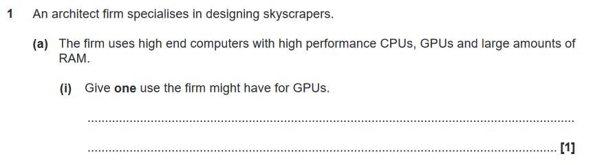
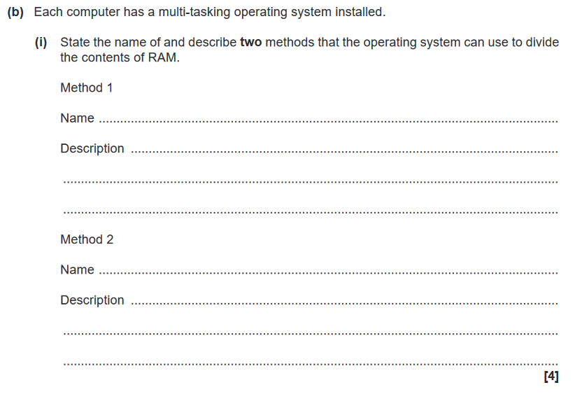
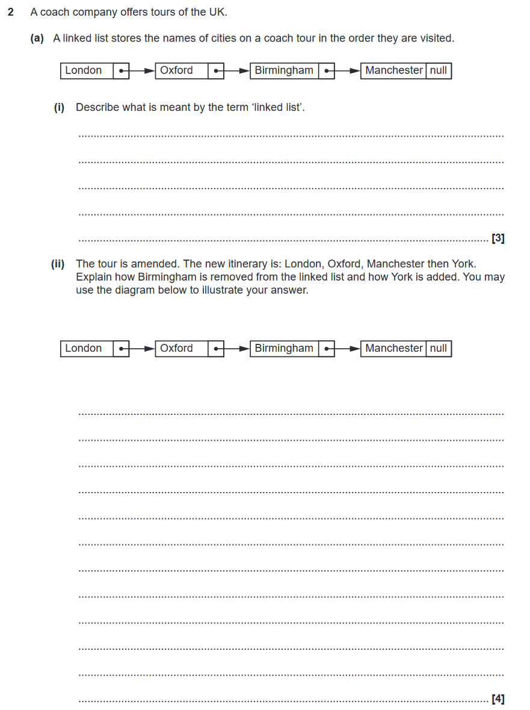
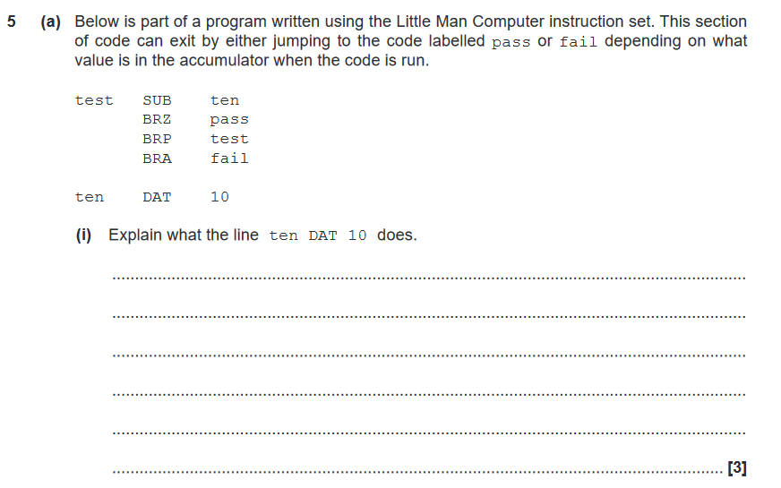
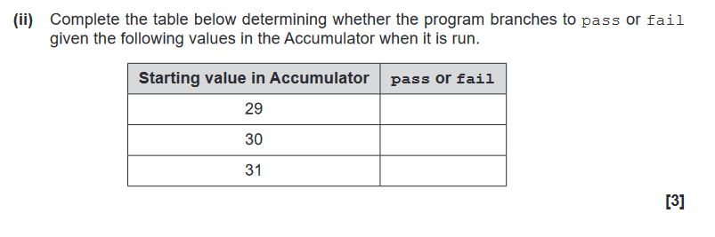

# File names

All files pertaining to a particular question should be stored in a folder named as follows:
`[year]-p[paper]-q[question]`.
Only the top-level question number should be included, not individual question parts.
The Markdown file should be named `index.md`.
Images from the question should be stored in the `png` format, named `fig[index].png`, where `index` starts from zero for each question.

## Example folder structure
- `2017-p1-q1`
  - `index.md`
  - `fig0.png`
  - `fig1.png`

# Question sectioning
Questions will be split into "information" and "question" sections, denoted by the following tags:

- `INF` marks the start of an information section
- `/INF` marks the end of an information section
- `QUE 1.a.i 2` marks the start of a question section for question 1. (a) (i) worth 2 marks
- `/QUE` marks the end of a question section

The text within sections should be formatted using standard Markdown.
Lines with section marks should have a line break between them.

## Example 1

Sequential `INF` blocks should be combined into one, even if they have different indentation in the question.



```markdown
INF

An architect firm specialises in designing skyscrapers. The firm uses high end computers with high performance CPUs, GPUs and large amounts of RAM.

/INF

QUE 1.a.i 1

Give **one** use the firm might have for GPUs.

/QUE
```

## Example 2

Guidance on where to write responses should be omitted.



```markdown
INF

Each computer has a multi-tasking operating system installed.

/INF

QUE 1.b.i 4

State the name of and describe **two** methods that the operating system can use to divide the contents of RAM.

/QUE
```

## Example 3

Where information or question sections refer to previous question parts, common sense should be applied.

*"The organisation looks at using either run length encoding or dictionary encoding to compress the file described in part (a)."*

could translate to

*"The organisation looks at using either run length encoding or dictionary encoding to compress the text file."*

or

*"The organisation looks at using either run length encoding or dictionary encoding to compress the file described previously."*

# Images
Any figures other than tables should be represented by images.
This includes data structure visualisations.

## Example 4

Images should usually be attached to information sections, but may be attached to question sections if they are part of the candidate's response.
Duplicated images should refer to the same file.
Paragraphs may be split into information and question sections according to common sense.
As a general rule, information sections should be as long as is reasonable, and question sections should usually start with the command word (e.g. "Explain how...").



```markdown
INF

A coach company offers tours of the UK. A linked list stores the names of cities on a coach tour in the order they are visited.


/INF

QUE 2.a.i 3

Describe what is meant by the term 'linked list'.

/QUE

INF

The tour is amended. The new itinerary is: London, Oxford, Manchester then York.

/INF

QUE 2.a.ii 4

Explain how Birmingham is removed from the linked list and how York is added. You may use the diagram below to illustrate your answer.


/QUE
```

# Boolean expressions

When writing Boolean expressions, the following symbols should be used:

- Identity ≡ (U+2261)
- And ∧ (U+2227)
- Or ∨ (U+2228)
- Not ¬ (U+00AC)

# Code

Two spaces should be used for indentation.
Spaces will not show up normally in markdown; use `&nbsp;` (non-breaking space) instead.
Anything in the monospaced "code" font should be marked as code.

## Example 5

For LMC code, the shortest gap between columns should be four spaces.



````markdown
INF

Below is part of a program written using the Little Man Computer instruction set. This section of code can exit by either jumping to the code labelled `pass` or `fail` depending on what value is in the accumulator when the code is run.

```
test    SUB    ten
        BRZ    pass
        BRP    test
        BRA    fail

ten     DAT    10
```

/INF

QUE 5.a.i 3

Explain what the line `ten DAT 10` does.

/QUE
````

# Tables

Where possible, tables should match the formatting of the original question.

## Example 6

Note the centre alignment in the first column.
Making tables look nice in the Markdown file does not affect how they are rendered; however, the JetBrains Markdown editor (e.g. in PyCharm) will format it for you.



```markdown
Complete the table below determining whether the program branches to `pass` or `fail` given the following values in the Accumulator when it is run.

| Starting value in Accumulator  | `pass` or `fail` |
|:------------------------------:|------------------|
|               29               |                  |
|               30               |                  |
|               31               |                  |
```